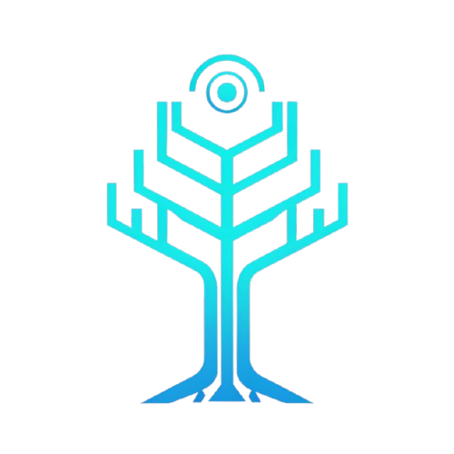

# ShaniAI

<div align="center">



## From Idea to Multi-Chain dApp Instantly

Foundational tools that eliminate the complexity of decentralized development

[](https://github.com/ShaniAI-tech)
[](https://github.com/ShaniAI-tech)
[](https://www.typescriptlang.org/)
[](https://github.com/ShaniAI-tech)

⚠️ Currently Under Development - Coming Soon

[Website](https://www.shaniai.tech) • [Documentation](https://github.com/ShaniAI-tech/ManifoldOS) • [Report Issues](https://github.com/ShaniAI-tech/ShaniAI/issues) • [Feature Requests](https://github.com/ShaniAI-tech/ShaniAI/issues)

</div>

## About ShaniAI

ShaniAI is revolutionizing decentralized application development by building foundational tools that eliminate complexity and accelerate developer onboarding on blockchains. Our mission is simple: **Start building, not boilerplate.**

---

## Development Status

**This project is currently under active development and not ready for production use.** The codebase is experimental, features are incomplete, and breaking changes are expected. We're building the foundation for multi-chain dApp development tools.

**Timeline**: Alpha release expected Q4 2024, with stable release in Q2 2025.


## The Problem We're Solving

Developers face three major challenges in blockchain development:

- **Endless Scaffolding**: Hours wasted on boilerplate code just to get started
- **Multi-Chain Maze**: Supporting multiple blockchains means juggling different SDKs, APIs, and deployment processes
- **Repetitive Logic**: Writing the same wallet connections, transaction handling, and state management over and over again

## Our Solution: Manifold OS

**Status**: Under Development

Manifold OS is our flagship product - a comprehensive platform for multi-chain dApp development that will generate production-ready applications with a single command.

### Planned Features

- **Zero to Production in Minutes**: Generate complete, production-ready dApp foundation instantly
- **Built for Multi-Chain World**: Support multiple blockchain ecosystems from day one
- **Enterprise-Grade**: Security-first architecture with comprehensive error handling
- **Developer Experience**: Modern tooling with TypeScript support and optimized build pipeline

## Future Vision: ShaniAI Canvas

Beyond Manifold OS, we're building **ShaniAI Canvas** - an intelligent visual interface where developers can:

- Design dApp architecture through natural language
- Generate complete applications with AI assistance
- Deploy across multiple chains with unified tooling
- Manage complex multi-chain applications from a single interface

## Planned Tech Stack

| Core Technologies | Blockchain Integration | Development Tools |
|-------------------|----------------------|-------------------|
| TypeScript | Multi-Chain SDKs | AI-Powered CLI |
| React/Next.js | Smart Contract Templates | Visual Designer |
| Node.js | Cross-Chain Bridges | Automated Testing |
| WebAssembly | Wallet Integrations | Deployment Pipeline |

## Architecture Overview (Planned)

```text
ShaniAI Ecosystem
├── manifold-os/             # Core development platform
│   ├── cli/                # Command-line interface
│   ├── templates/          # Project templates
│   ├── chains/            # Blockchain integrations
│   └── sdk/               # Software development kit  
├── shani-canvas/           # Visual development interface
│   ├── designer/          # Visual application builder
│   ├── ai-engine/         # Natural language processing
│   └── deployment/        # Multi-chain deployment
├── tools/                 # Supporting utilities
│   ├── testing/           # Automated testing framework
│   ├── monitoring/        # Application monitoring
│   └── analytics/         # Usage analytics
└── docs/                  # Documentation and guides
```

## Getting Started (When Available)

### Prerequisites (Planned)

- **Node.js** (v18+)
- **Git** for version control
- **Docker** (optional, for containerized development)
- **Wallet** (MetaMask, WalletConnect compatible)

### Installation (Coming Soon)

```bash
# Install ShaniAI CLI globally
npm install -g @shani-ai/cli

# Create new multi-chain dApp
shani create my-dapp --chains ethereum,polygon,arbitrum

# Start development
cd my-dapp
shani dev
```

## Development Roadmap

### Phase 1: Foundation (Current)

- Core architecture design
- Basic CLI development
- Template system creation
- Multi-chain integration research

### Phase 2: Manifold OS Alpha

- CLI tool release
- Basic template generation
- Ethereum and Polygon support
- Developer documentation

### Phase 3: Manifold OS Beta

- Extended chain support
- Advanced templates
- Testing framework
- Community feedback integration

### Phase 4: ShaniAI Canvas

- Visual development interface
- AI-powered generation
- Natural language processing
- Production deployment tools

## Current Status

**This project is under active development.** We are building the foundational tools that will revolutionize how developers create decentralized applications.

**What's Being Built:**

- Core architecture and design patterns
- Multi-chain integration framework
- CLI tool development
- Template and scaffolding system
- AI-powered code generation research

**Timeline:** Expected alpha release in Q2 2025

## Community & Contributing

We're building ShaniAI in the open and welcome community input! While the core development is ongoing, you can:

**Stay Updated:**

- Follow our progress on [GitHub](https://github.com/ShaniAI-tech)
- Join discussions in our issues
- Star the repository for updates

**Early Access:**

- Sign up for beta testing notifications
- Provide feedback on our approach
- Share your blockchain development pain points

**When We Launch:**

- Contribute code to open-source components
- Create templates and examples
- Help improve documentation
- Report bugs and suggest features

## License

This project will be released under an open-source license (details TBD). Core tools will be free for developers, with premium features for enterprise use.

## Contact & Updates

### ShaniAI Team

[](https://github.com/ShaniAI-tech)
[](https://twitter.com/ShaniAI_tech)
[](https://linkedin.com/company/shani-ai)

**Founder**: Soham Sanjay Pawar
**Email**: [soham@shaniai.tech](mailto:soham@shaniai.tech)
**Website**: [www.shaniai.tech](https://www.shaniai.tech)

---

### Building the future of decentralized development

From idea to multi-chain dApp. Instantly.
